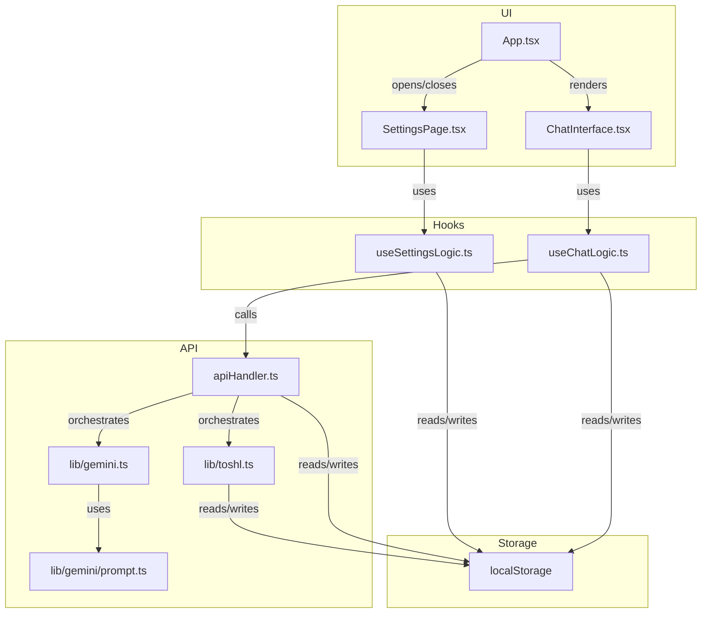

# Toshl WebApp Chat – Logic & Architecture Overview

This document provides a clear, up-to-date explanation of the core architecture, data flow, and logic of the Toshl WebApp Chat application. It is based on the current codebase, including all major React components, hooks, and supporting libraries.

---

## Application Flow Diagram

---

## 1. Core Architecture

- **App.tsx**: The root component. Handles layout, initialization, and conditional rendering of the chat and settings interfaces. Checks for required API keys in `localStorage` and manages the visibility of the settings sidebar.
- **ChatInterface.tsx**: The main chat UI. Renders header, messages, input, and controls. Delegates all chat-related state and logic to the `useChatLogic` hook.
- **SettingsPage.tsx**: UI for user configuration. Lets users enter API keys, select currency/Gemini model, and clear chat history. Delegates logic and state to `useSettingsLogic`.
- **useChatLogic.ts**: Custom React hook providing all chat state and logic, including message management, API interactions, mention handling, offline support, and history fetching.
- **useSettingsLogic.ts**: Custom hook for settings state and logic. Handles API key validation, metadata fetching, and persistence to `localStorage`.
- **apiHandler.ts**: Centralizes all API calls and orchestration between Gemini and Toshl. Handles request routing, data formatting, and error handling.
- **lib/toshl.ts**: Handles all Toshl API operations (fetch, add, edit, delete entries and metadata). Used by `apiHandler.ts`.
- **lib/gemini.ts**: Handles all Gemini API interactions, including prompt construction and response parsing.
- **lib/gemini/prompt.ts**: Builds dynamic prompts for Gemini using templates and runtime data.
- **AccountBalanceCard.tsx, BudgetCard.tsx, HistoryCard.tsx**: Specialized UI components for displaying Toshl account, budget, and entry data in chat.
- **localStorage**: Used throughout to persist API keys, settings, Toshl metadata, chat history, and user preferences.

---

## 2. Initialization & State Flow

### On App Startup (App.tsx)
1. On mount, checks for `toshlApiKey` and `geminiApiKey` in `localStorage`.
2. If missing, opens the settings sidebar for user input.
3. Loads the `hideNumbers` preference from storage.
4. Sets up listeners for online/offline browser events (via `useChatLogic`).
5. Lazy-loads `ChatInterface` and `SettingsPage` for performance.

---

## 3. Settings Management (SettingsPage.tsx & useSettingsLogic.ts)
1. User enters Toshl and Gemini API keys, selects currency/model, and saves.
2. Inputs are validated by `useSettingsLogic`.
3. Valid settings are saved to `localStorage`.
4. Metadata (accounts, categories, tags) is fetched from Toshl and stored locally.
5. Settings UI displays feedback and closes on success.

---

## 4. Chat Logic & Message Flow (ChatInterface.tsx & useChatLogic.ts)

### Sending a Message (Online)
1. User types and submits a request.
2. Input is validated (non-empty, not offline, not loading).
3. User message is added to chat state.
4. Loading indicator is shown.
5. `handleFormSubmit` calls `handleProcessUserRequestApi` (API handler).
6. API handler:
   - Loads all required data (API keys, settings, Toshl metadata) from `localStorage`.
   - Prepares chat history for Gemini.
   - Sends request to Gemini and parses action/response.
   - If needed, calls Toshl API (add/edit/delete entry, fetch history, accounts, budgets).
   - Formats all results into `Message` objects for display.
7. Chat state is updated with new messages, context, and any updated entry IDs.
8. Loading indicator is removed, UI scrolls to bottom, and state is persisted to `localStorage`.

### Fetching History (handleFetchDateRange)
1. User clicks the History button.
2. If offline, an error is shown.
3. Otherwise, loading state is set and a loading message is displayed.
4. API handler fetches entries for the selected date range and formats them as messages.
5. Results are displayed, including a 'See More' option if truncated.

### Deleting an Entry
1. User clicks the delete icon on an entry.
2. `handleDeleteEntry` validates the request and calls the API handler.
3. Toshl API is called to delete the entry.
4. On success, the message is updated to reflect deletion. On error, an error message is shown.

### Showing More Entries/Accounts/Budgets
- 'See More' cards open a bottom sheet with the full list for the selected group (entries, accounts, budgets).

---

## 5. Offline Support
- `useChatLogic` tracks online/offline status.
- If offline, submitted messages are marked as 'pending' and saved locally with a unique `offlineId`.
- When online, pending messages are automatically retried and updated based on API responses.
- Errors are handled and surfaced to the user if retries fail.

---

## 6. Mention Feature
- Typing `@` in the chat input triggers a popup with filtered suggestions for Toshl accounts, categories, and tags.
- Suggestions are dynamically filtered as the user types.
- Selecting a suggestion inserts a formatted mention into the input.
- The popup closes on space, deletion, cursor movement, or submit.

---

## 7. Data Persistence & Local Storage
- API keys, user settings, Toshl metadata, chat history, and preferences (like `hideNumbers`) are all stored in `localStorage`.
- State is loaded from storage on startup and updated after relevant actions.

---

## 8. Error Handling & User Feedback
- All API operations are wrapped with error handling.
- Errors (e.g., offline actions, failed API calls) are surfaced in the chat as system messages or UI toasts.
- Loading, retry, and deletion states are clearly indicated in the UI.

---

## 9. Extensibility
- The architecture is modular, with clear separation between UI, logic hooks, and API handlers.
- Adding new Toshl or Gemini features typically involves updating the API handler, logic hook, and possibly new UI cards/components.

---

*This document is based on direct inspection of the current codebase (April 2025). For further technical details, see the source files referenced above.*
